# Workflows Quick Reference

## Workflow Overview


## CI Workflow Pipeline


## Release Workflow Pipeline

```mermaid
sequenceDiagram
    participant Dev as Developer
    participant GH as GitHub
    participant CI as CI Workflow
    participant Rel as Release Workflow
    participant npm as npm Registry

    Dev->>GH: Push conventional commit
    GH->>CI: Trigger CI checks
    CI->>CI: Lint, Test, Build
    CI->>GH: ✅ CI Pass

    GH->>Rel: Trigger Release
    Rel->>Rel: Analyze commits

    alt Release Needed
        Rel->>Rel: Determine version bump
        Rel->>GH: Update package.json
        Rel->>GH: Create Git tag
        Rel->>GH: Create GitHub Release
        Rel->>npm: Publish package
        npm->>Rel: ✅ Publish success
        Rel->>GH: Verify publication
    else No Release Needed
        Rel->>GH: Skip release
    end
```



## Workflow Trigger Matrix

| Workflow | Push to main | Push to develop | Pull Request | Schedule | Manual |
|----------|-------------|-----------------|--------------|----------|--------|
| **CI** | ✅ | ✅ | ✅ | ❌ | ❌ |
| **Release** | ✅ | ❌ | ❌ | ❌ | ✅ |
| **CodeQL** | ✅ | ✅ | ✅ | ✅ (Mon 2am) | ✅ |
| **Dependency Review** | ❌ | ❌ | ✅ | ❌ | ❌ |
| **PR Checks** | ❌ | ❌ | ✅ | ❌ | ❌ |

## Job Dependencies

### CI Workflow
```
┌─────────┐  ┌──────────┐  ┌───────┐
│  Lint   │  │Typecheck │  │ Build │
└────┬────┘  └────┬─────┘  └───┬───┘
     │            │            │
     └────────────┴────────────┘
                  │
          ┌───────▼───────┐
          │   Test Matrix │
          └───────┬───────┘
                  │
          ┌───────▼────────┐
          │  Test Package  │
          └───────┬────────┘
                  │
          ┌───────▼────────┐
          │   Security     │
          └───────┬────────┘
                  │
          ┌───────▼────────┐
          │  CI Success    │
          └────────────────┘
```

### Release Workflow
```
┌──────────┐
│ Analyze  │
└────┬─────┘
     │
     ▼
┌──────────┐
│ Release  │
└────┬─────┘
     │
     ▼
┌──────────┐
│ Publish  │
└────┬─────┘
     │
     ▼
┌──────────┐
│  Notify  │
└──────────┘
```

## Workflow Commands

### Trigger Manual Release
```bash
# Via GitHub CLI
gh workflow run release.yml \
  --ref main \
  --field release-type=patch

# Via GitHub UI
# Navigate to: Actions → Release → Run workflow
```

### View Workflow Status
```bash
# List recent runs
gh run list --workflow=ci.yml --limit 10

# Watch current run
gh run watch

# View specific run
gh run view <run-id>

# Download logs
gh run download <run-id>
```

### Cancel Workflow
```bash
# Cancel specific run
gh run cancel <run-id>

# Cancel all runs for a workflow
gh run list --workflow=ci.yml --json databaseId --jq '.[].databaseId' | \
  xargs -I {} gh run cancel {}
```

### Re-run Failed Workflow
```bash
# Re-run failed jobs only
gh run rerun <run-id> --failed

# Re-run entire workflow
gh run rerun <run-id>
```

## Environment Variables

### CI Workflow
| Variable | Description | Example |
|----------|-------------|---------|
| `NODE_ENV` | Node environment | `test` |
| `CI` | CI environment flag | `true` |

### Release Workflow
| Variable | Description | Example |
|----------|-------------|---------|
| `NODE_AUTH_TOKEN` | npm authentication | `${{ secrets.NPM_TOKEN }}` |
| `GITHUB_TOKEN` | GitHub API token | Auto-provided |

## Caching Strategy

### npm Dependencies
```yaml
- uses: actions/setup-node@v4
  with:
    cache: 'npm'
```

**Cache Key:** Hash of `package-lock.json`
**Cache Location:** `~/.npm`
**TTL:** 7 days (automatic)

### Build Artifacts
```yaml
- uses: actions/upload-artifact@v4
  with:
    retention-days: 7
```

**Storage:** GitHub Actions artifacts
**TTL:** 7 days
**Size Limit:** 10 GB per repository

## Performance Metrics

### Typical Execution Times

| Workflow | Duration | Parallelization |
|----------|----------|----------------|
| CI (PR) | 5-7 min | 10 parallel jobs |
| CI (Full) | 8-12 min | 15 parallel jobs |
| Release | 10-15 min | Sequential |
| CodeQL | 3-5 min | Single job |
| PR Checks | 1-2 min | 3 parallel jobs |

### Optimization Strategies

1. **npm Cache**: Saves ~30-60s per job
2. **Matrix Reduction**: PRs skip some OS/Node combinations
3. **Fail-fast: false**: Completes all tests even if one fails
4. **Concurrency Groups**: Cancels outdated PR runs
5. **Parallel Jobs**: Independent jobs run simultaneously

## Security Hardening

### Token Permissions
```yaml
permissions:
  contents: write        # Create releases, push tags
  issues: write          # Comment on issues
  pull-requests: write   # Comment on PRs
  security-events: write # CodeQL results
```

### Secret Usage
- **NPM_TOKEN**: Scoped to publish only
- **GITHUB_TOKEN**: Auto-expires after workflow
- **CODECOV_TOKEN**: Read-only upload access

### Branch Protection
- Require PR reviews
- Require status checks
- Restrict force pushes
- Require signed commits (optional)

## Monitoring & Alerts

### GitHub Actions Insights
```bash
# View workflow usage
gh api repos/:owner/:repo/actions/workflows/:workflow_id/timing

# View billing info
gh api user/settings/billing/actions
```

### Failure Notifications
- Email on workflow failure (GitHub default)
- Slack integration (optional)
- Discord webhooks (optional)

### Metrics to Monitor
- ✅ CI success rate (target: >95%)
- ⏱️ Average workflow duration
- 📦 npm download trends
- 🔒 Security vulnerabilities
- 📊 Test coverage trends

## Best Practices

### Commit Messages
✅ **Good:**
```
feat: add WebP image format support
fix: handle corrupted PNG headers
docs: update API documentation
```

❌ **Bad:**
```
added stuff
fixed bug
updates
```

### PR Titles
✅ **Good:**
```
feat: implement AVIF decoder
fix: resolve memory leak in stream parser
refactor: optimize PNG chunk reading
```

❌ **Bad:**
```
Update code
Fixed issues
Changes
```

### Version Bumps
- **Patch (1.0.X)**: Bug fixes, documentation
- **Minor (1.X.0)**: New features, backwards compatible
- **Major (X.0.0)**: Breaking changes, API redesign

## Troubleshooting Quick Fixes

### Issue: CI Slow
```bash
# Check cache hit rate
gh api repos/:owner/:repo/actions/caches

# Clear cache if stale
gh api -X DELETE repos/:owner/:repo/actions/caches
```

### Issue: Release Not Created
```bash
# Check commit format
git log --oneline -10

# Manually trigger
gh workflow run release.yml --field release-type=patch
```

### Issue: npm Publish Fails
```bash
# Verify token
npm whoami --registry=https://registry.npmjs.org

# Regenerate and update secret
npm token create --type=automation
```

### Issue: Tests Flaky
```bash
# Run locally with same Node version
nvm use 20
npm test

# Check matrix logs for patterns
gh run view <run-id> --log | grep -i "error"
```

## Additional Commands

### Package Verification
```bash
# Verify package contents before publish
npm pack --dry-run

# Test installation locally
npm link
npm link image-specs
```

### Release Verification
```bash
# Check latest npm version
npm view image-specs version

# Check GitHub release
gh release view latest

# Verify tag
git tag -l "v*" | tail -5
```

### Coverage Check
```bash
# Run coverage locally
npm run test:coverage

# View coverage report
open coverage/index.html
```

## Useful Links

- 📖 [GitHub Actions Docs](https://docs.github.com/en/actions)
- 📦 [npm Publishing](https://docs.npmjs.com/cli/v10/commands/npm-publish)
- 🔖 [Conventional Commits](https://www.conventionalcommits.org/)
- 🏷️ [Semantic Versioning](https://semver.org/)
- 🔐 [Security Best Practices](https://docs.github.com/en/actions/security-guides)
